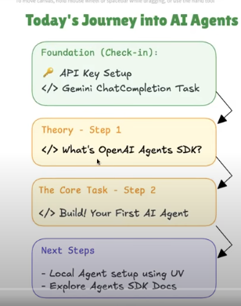

## Class 03 — OpenAI Agents SDK • Hello World (Gemini)

<div align="center">

[](https://colab.research.google.com/github/ARAhmadDeveloper/AI-Agents/blob/master/Class_03/OpenAI_agents_SDK_Hello_world.ipynb)

</div>

---

### Overview

This class notebook demonstrates how to build a conversational agent using the `openai-agents` library with Google's Gemini API. It shows two execution methods (synchronous and asynchronous) and includes a small, fun example: a Recipe Bot.

<div align="center">



</div>

---

### Table of Contents

- **Project Files**
- **Prerequisites**
- **Setup**
- **Synchronous Agent Run**
- **Asynchronous Agent Run**
- **Example: Recipe Bot**
- **Troubleshooting**
- **Credits**

---

### Project Files

- `OpenAI_agents_SDK_Hello_world.ipynb`: The notebook for this class.
- `goal.png`: Visual overview/goal image for the project.

If you prefer running in the cloud, use the Colab badge above to open the notebook directly.

---

### Prerequisites

- A Python environment (Colab recommended for the smoothest experience).
- A valid Gemini API key stored in Colab `userdata` as `GEMINI_API_KEY`.

---

### Setup

Install the required library in your environment (the notebook uses this exact command):

```bash
pip install -Uq openai-agents
```

Core imports and setup used in the notebook:

```python
import nest_asyncio
nest_asyncio.apply()

from agents import Agent, Runner, AsyncOpenAI, OpenAIChatCompletionsModel, set_tracing_disabled
```

Retrieve your Gemini API key from Colab `userdata`:

```python
from google.colab import userdata
gemini_api_key = userdata.get("GEMINI_API_KEY")
```

Create the client and model for Gemini (as used in the notebook):

```python
# Disable tracing (optional)
set_tracing_disabled(disabled=True)

# 1) Which LLM service?
external_client: AsyncOpenAI = AsyncOpenAI(
    api_key=gemini_api_key,
    base_url="https://generativelanguage.googleapis.com/v1beta/openai/",
)

# 2) Which LLM model?
llm_model: OpenAIChatCompletionsModel = OpenAIChatCompletionsModel(
    model="gemini-2.5-flash",
    openai_client=external_client
)
```

---

### Synchronous Agent Run

The notebook demonstrates a synchronous call where an agent answers a history question:

```python
math_agent: Agent = Agent(
    name="HistoryAgent",
    instructions="You are a helpful History assistant.",
    model=llm_model,
)

result: Runner = Runner.run_sync(
    math_agent,
    "What are the fourteen points of Muhammad Ali Jinnah?",
)

print("\nCALLING AGENT\n")
print(result.final_output)
```

---

### Asynchronous Agent Run

The notebook also shows how to run the same agent asynchronously:

```python
import asyncio

async def main():
    result: Runner = await Runner.run(
        math_agent,
        "Tell me about recursion in programming.",
    )
    print(result.final_output)

asyncio.run(main())
```

---

### Example: Recipe Bot

A compact example agent that suggests a simple recipe from a short list of ingredients:

```python
set_tracing_disabled(disabled=True)

# Client Setup for Connecting to Gemini
external_client: AsyncOpenAI = AsyncOpenAI(
    api_key=gemini_api_key,
    base_url="https://generativelanguage.googleapis.com/v1beta/openai/",
)

# Initialize model
model: OpenAIChatCompletionsModel = OpenAIChatCompletionsModel(
    model="gemini-2.5-flash",
    openai_client=external_client,
)

def main():
    # Create the Recipe Agent
    agent = Agent(
        name="RecipeBot",
        instructions=(
            """You are a helpful recipe assistant. A user will give you a few ingredients
            they have at home, and you will suggest one simple and quick recipe using only those items.
            Keep it short, step-by-step, and easy for beginners to cook."""
        ),
        model=model,
    )

    print("\n🍳 What can I cook today?\n")
    ingredients = "eggs, tomatoes, onions, and bread"
    result: Runner = Runner.run_sync(
        agent,
        f"I have these at home: {ingredients}. What can I cook?",
    )

    print(result.final_output)

if __name__ == "__main__":
    main()
```

---

### Troubleshooting

- **API key missing**: Ensure `GEMINI_API_KEY` is set in Colab → Runtime → Run anyway (if prompted) → `from google.colab import userdata` → add the key in the Colab UI.
- **Long outputs truncated**: Some notebook outputs may be truncated in the preview; re-run the cell to view full content.
- **Local runs**: This notebook is optimized for Colab. If you run locally, replace the Colab `userdata.get(...)` with environment variable loading.

---

### Credits

Built for Class 03 to explore `openai-agents` with Gemini using both synchronous and asynchronous agent execution, culminating in a simple Recipe Bot example.

<div align="center">

— Made with ❤️ by —

<h3 style="margin: 6px 0;">@<span>arahmaddeveloper</span></h3>

</div>
